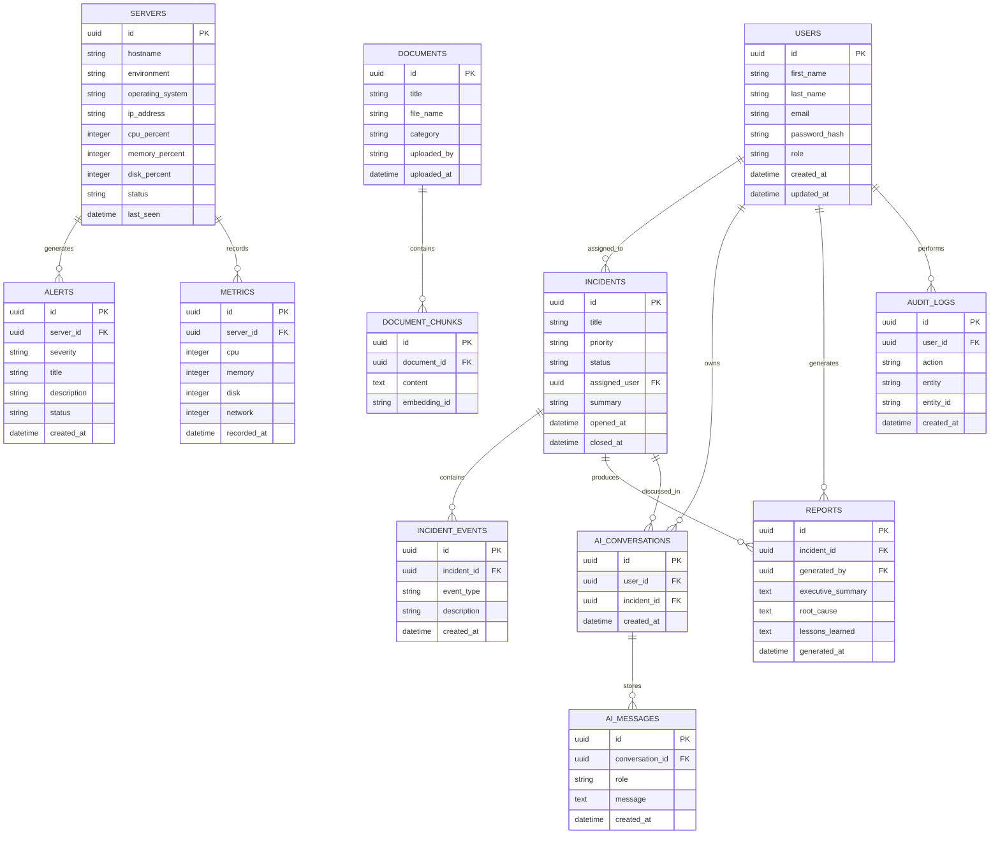

# OpsPilot Database Schema

```mermaid
erDiagram

    USERS {
        uuid id PK
        string first_name
        string last_name
        string email
        string password_hash
        string role
        datetime created_at
        datetime updated_at
    }

    SERVERS {
        uuid id PK
        string hostname
        string environment
        string operating_system
        string ip_address
        integer cpu_percent
        integer memory_percent
        integer disk_percent
        string status
        datetime last_seen
    }

    ALERTS {
        uuid id PK
        uuid server_id FK
        string severity
        string title
        string description
        string status
        datetime created_at
    }

    INCIDENTS {
        uuid id PK
        string title
        string priority
        string status
        uuid assigned_user FK
        string summary
        datetime opened_at
        datetime closed_at
    }

    INCIDENT_EVENTS {
        uuid id PK
        uuid incident_id FK
        string event_type
        string description
        datetime created_at
    }

    DOCUMENTS {
        uuid id PK
        string title
        string file_name
        string category
        string uploaded_by
        datetime uploaded_at
    }

    DOCUMENT_CHUNKS {
        uuid id PK
        uuid document_id FK
        text content
        string embedding_id
    }

    AI_CONVERSATIONS {
        uuid id PK
        uuid user_id FK
        uuid incident_id FK
        datetime created_at
    }

    AI_MESSAGES {
        uuid id PK
        uuid conversation_id FK
        string role
        text message
        datetime created_at
    }

    REPORTS {
        uuid id PK
        uuid incident_id FK
        uuid generated_by FK
        text executive_summary
        text root_cause
        text lessons_learned
        datetime generated_at
    }

    METRICS {
        uuid id PK
        uuid server_id FK
        integer cpu
        integer memory
        integer disk
        integer network
        datetime recorded_at
    }

    AUDIT_LOGS {
        uuid id PK
        uuid user_id FK
        string action
        string entity
        string entity_id
        datetime created_at
    }

    USERS ||--o{ INCIDENTS : assigned_to
    USERS ||--o{ AI_CONVERSATIONS : owns
    USERS ||--o{ REPORTS : generates
    USERS ||--o{ AUDIT_LOGS : performs

    SERVERS ||--o{ ALERTS : generates
    SERVERS ||--o{ METRICS : records

    INCIDENTS ||--o{ INCIDENT_EVENTS : contains
    INCIDENTS ||--o{ REPORTS : produces
    INCIDENTS ||--o{ AI_CONVERSATIONS : discussed_in

    DOCUMENTS ||--o{ DOCUMENT_CHUNKS : contains

    AI_CONVERSATIONS ||--o{ AI_MESSAGES : stores
```